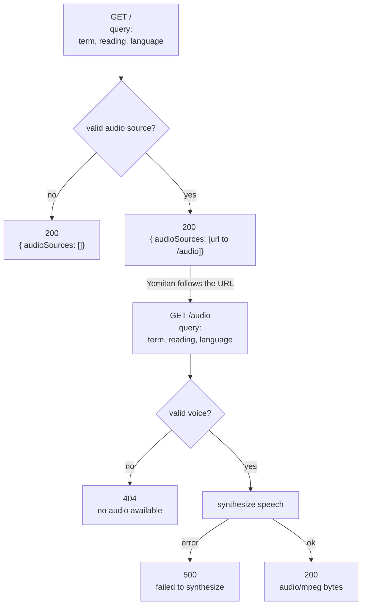

## Quick News

- **[AUR bot attack](https://www.theregister.com/security/2026/06/15/arch-linux-locks-down-aur-signups-amid-wave-of-malicious-commits/5255511) poisoned 1% (1500) of entire repositories (150,000) in AUR.**
  I am back to firefox browser instead of brave browser which was installed from AUR.
- **TypeScript 7 breaks the [Astro language server](https://github.com/withastro/roadmap/discussions/1321).** TypeScript 7.0 shipped as a
  ground-up rewrite in Go (10x faster builds, no argument there), but it dropped the
  programmatic compiler API that tools rely on to embed. Astro, Vue, and
  Svelte all lean on that API for their language servers, so right now just
  lost editor support, not a broken build but a broken LSP.
- **[Go Report Card](https://github.com/gojp/goreportcard) is archived.** The repo was
  archived on July 1st and if you were relying on the hosted badge, it's time to self-host
  or drop it completely.
- **[Laverna](https://github.com/occamist/laverna#yomitan) (my personal project for language learning)** gets an audio HTTP server for Yomitan.

We'll drill down into the last one, but first let's talk about what Yomitan actually is.

## What is Yomitan, and why I ditch Anki

[Yomitan](https://github.com/yomidevs/yomitan) is a free browser extension that gives you an instant pop-up dictionary for
whatever you're reading on the web. Hover or click a word, and it shows nouns, verbs and
adjectives on the fly, shows you definitions from whichever dictionaries you've imported, and can play pronunciation audio, all without leaving the page.

Anki, by contrast, is a spaced-repetition flashcard app. It's fantastic at drilling cards
you already made, but it does nothing for you while you're actually reading a real life story, the news.
You either stop and alt-tab to a dictionary, or you pre-mine a
deck ahead of time and lose the "I hit this word in the wild" context that makes it
memorable in the first place.

Yomitan fixes that friction: the dictionary comes to you, inline, at the moment you need
it. But there was one problem, even though dictionaries were nice and wicked fast, audio sources were not that extensive and
I would hit the famous empty click sound. Since my Laverna CLI was already great at generating audios for many languages,
I decided to make a custom HTTP server that helps Yomitan to play better audio source.

## Yomitan Audio HTTP Server in Laverna

Yomitan lets you configure custom audio sources under Settings → Audio → Configure Audio
Playback Sources. One of the supported types is "Custom URL (JSON)": you give it a URL
template, and whenever you look up a word, Yomitan calls that URL with `term`, `reading`,
and `language` filled in, and expects back a JSON list of candidate audio URLs.

[Laverna PR](https://github.com/occamist/laverna/pull/41) adds exactly that as a new
`laverna yomitan` command, reusing the same `synthesize` package that already powers
`laverna run` and `laverna anki`.

The handler exposes two routes instead of one, because Yomitan's fetch layer only
follows plain `http(s)://` URLs, not `data:` URIs. So `/` just answers the discovery
request with a JSON list pointing at `/audio`, and `/audio` is the one that actually
calls `synthesize.Run` and streams back the mp3:

```go
func NewHandler(client *http.Client, https bool) http.Handler {
	mux := http.NewServeMux()
	mux.HandleFunc("/", audioSourceListHandler(https))
	mux.HandleFunc("/audio", audioHandler(client))      
	return mux
}
```

Here's what the two handlers do:



Available since Laverna version v0.6.0:

```shell
❯ laverna yomitan --port 8770
2026/07/10 00:00:00 listening on "localhost:8770"

❯ curl "http://localhost:8770/?term=รัฐมนตรี&reading=รัฐมนตรี&language=th"
{"type":"audioSourceList","audioSources":[{"name":"Laverna","url":"http://localhost:8770/audio?language=th&reading=รัฐมนตรี&term=รัฐมนตรี"}]}
```

Point Yomitan's audio source at
`http://localhost:8770?term={term}&reading={reading}&language={language}` and every
lookup gets a Laverna-synthesized audio option alongside whatever other sources you've
configured. And the best part is there is no storage requirement!

## Final Words

Not everyone wants to run a local server just to get audio, especially on a
phone or tablet where there's no terminal to leave `laverna yomitan` running in. So
[occamist.dev now hosts its own instance](https://github.com/occamist/laverna#yomitan)
at `yomitan.occamist.dev`, and you can point Yomitan straight at it instead:

```text
https://yomitan.occamist.dev/?term={term}&reading={reading}&language={language}
```

No setup required other than Yomitan as your browser extension, works from any device Yomitan runs on.

Laverna loves Yomitan! happy learning.
